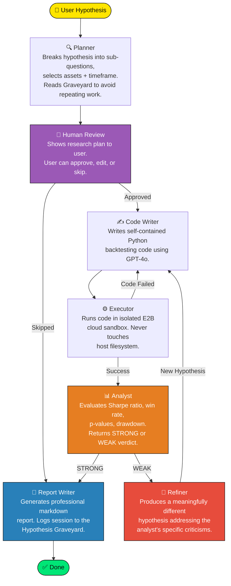
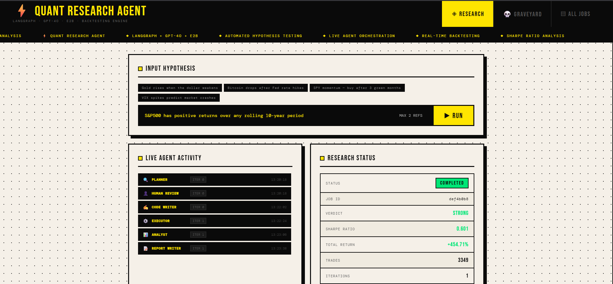
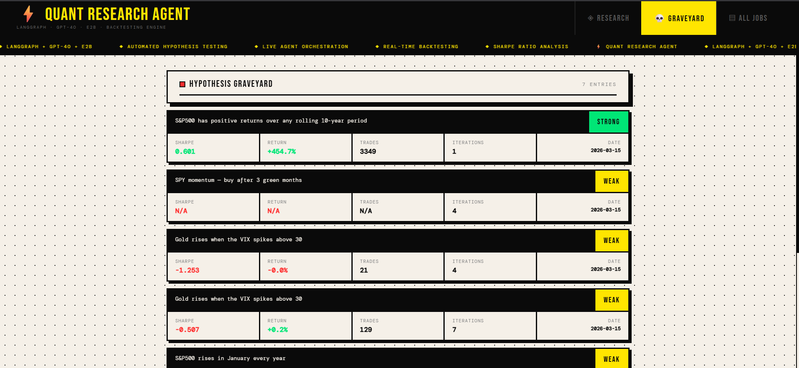

# ⚡ Autonomous Quant Research Agent

> _An agentic AI system that thinks like a quant researcher — autonomously writing backtesting code, stress-testing financial hypotheses, and generating institutional-grade research reports._

Built with **LangGraph** · **GPT-5-mini** · **E2B Sandboxed Execution** · **React**

---

## 🎯 What It Does

You give it a hypothesis. It does the rest.

```
"S&P500 has positive returns over any rolling 10-year period"
```

The system autonomously:

- 🔍 **Plans** the research approach and selects relevant assets + timeframe
- 👤 **Asks for approval** before writing any code (human-in-the-loop)
- ✍️ **Writes** Python backtesting code from scratch using GPT-4o
- ⚙️ **Executes** it securely in an isolated E2B cloud sandbox
- 📊 **Evaluates** statistical significance — Sharpe ratio, p-values, bootstrap CIs, win rate
- 🔄 **Refines** the hypothesis autonomously if results are weak
- 📝 **Generates** a professional markdown research report
- 💀 **Logs** everything to a persistent Hypothesis Graveyard

---

## 🏗️ Architecture

This system uses a **cyclic graph architecture** with persistent state management, built on LangGraph. The graph has two feedback loops — a code retry loop and a hypothesis refinement loop — making it a true agentic system rather than a linear pipeline.



### Agent Roles

| Agent                | Responsibility                                                                                                                                         |
| -------------------- | ------------------------------------------------------------------------------------------------------------------------------------------------------ |
| 🔍 **Planner**       | Breaks hypothesis into testable sub-questions, selects assets and timeframe. Reads the Hypothesis Graveyard to avoid repeating past approaches.        |
| 👤 **Human Review**  | Pauses execution after planning so the user can approve, edit, or reject the research plan before any code runs or API credits are spent.              |
| ✍️ **Code Writer**   | Writes fully self-contained Python backtesting code. On failure, receives the exact error message and auto-fixes with targeted hints.                  |
| ⚙️ **Executor**      | Runs LLM-generated code in an isolated E2B cloud VM. The sandbox cannot access the host filesystem, preventing any security risk from untrusted code.  |
| 📊 **Analyst**       | Evaluates backtest results statistically — Sharpe ratio, win rate, p-values, bootstrap confidence intervals, max drawdown. Returns `STRONG` or `WEAK`. |
| 🔄 **Refiner**       | On a weak verdict, reads the analyst's specific criticisms and produces a meaningfully different hypothesis — not just a rephrasing — and loops back.  |
| 📝 **Report Writer** | Generates a structured markdown research report with methodology, results, statistical analysis, and conclusion. Logs the session to the Graveyard.    |

---

## 💀 Hypothesis Graveyard

One of the most distinctive features. Every research session — strong or weak — gets logged permanently to a SQLite database with:

- Original and final hypothesis tested
- Sharpe ratio, total return, win rate, max drawdown
- Full analyst reasoning and suggested refinements
- Number of iterations the agent went through
- Path to the generated report

The **Planner reads the Graveyard before every run**, so the system builds institutional memory over time and avoids repeating approaches that have already been tested and rejected.

> _Most financial hypotheses don't hold in data. That's real finance, not a bug. A system that rigorously rejects hypotheses is more valuable than one that confirms them._

---

## 🖥️ Screenshots

### Research Tab — Live Agent Activity



### Hypothesis Graveyard



---

## 🛠️ Tech Stack

| Layer                | Technology       | Why                                             |
| -------------------- | ---------------- | ----------------------------------------------- |
| Agent Orchestration  | **LangGraph**    | Stateful cyclic graphs with conditional routing |
| LLM                  | **GPT-4o**       | Code generation + statistical reasoning         |
| Code Execution       | **E2B Sandbox**  | Isolated cloud VM for untrusted LLM code        |
| Financial Data       | **yfinance**     | Free historical OHLCV data                      |
| Statistical Analysis | **scipy, numpy** | Bootstrap CIs, permutation tests, OLS           |
| Backend API          | **FastAPI**      | Async REST API with background tasks            |
| Frontend             | **React**        | Live agent feed, report viewer, graveyard UI    |
| Persistent Memory    | **SQLite**       | Hypothesis Graveyard across sessions            |
| Charts               | **matplotlib**   | Backtest visualizations                         |

---

## 📁 Project Structure

```
quant-research-agent/
│
├── agents/                  # One file per agent
│   ├── planner.py           # Research planning + graveyard awareness
│   ├── code_writer.py       # GPT-4o backtesting code generation
│   ├── executor.py          # E2B sandboxed execution
│   ├── analyst.py           # Statistical evaluation + verdict
│   ├── refiner.py           # Hypothesis refinement
│   ├── report_writer.py     # Markdown report generation
│   └── human_review.py      # Human-in-the-loop approval
│
├── graph/
│   ├── state.py             # LangGraph TypedDict state schema
│   └── graph.py             # Graph nodes, edges + routing functions
│
├── tools/
│   ├── fetch_data.py        # yfinance data fetcher + fallback chart
│   ├── graveyard.py         # SQLite persistence layer
│   └── streaming.py         # Terminal streaming output
│
├── api/
│   └── main.py              # FastAPI backend (8 endpoints)
│
├── outputs/                 # Generated reports, charts, graveyard.db
├── main.py                  # CLI entry point
├── .env.example             # Environment variable template
├── requirements.txt
└── quant-frontend/          # React frontend
    └── src/App.js           # Single-file React app
```

---

## 🚀 Setup

### Prerequisites

- Python 3.11+
- Node.js 18+
- OpenAI API key — [platform.openai.com](https://platform.openai.com)
- E2B API key — free tier at [e2b.dev](https://e2b.dev)

### Installation

```bash
# Clone the repo
git clone https://github.com/MohitMurarka/quant-research-agent
cd quant-research-agent

# Create virtual environment
python -m venv venv
venv\Scripts\activate        # Windows
source venv/bin/activate     # Mac/Linux

# Install Python dependencies
pip install -r requirements.txt

# Configure environment
cp .env.example .env
# Edit .env and add your OPENAI_API_KEY and E2B_API_KEY
```

### Running

```bash
# Terminal 1 — Backend API (port 8000)
uvicorn api.main:app --reload --port 8000

# Terminal 2 — React Frontend (port 3000)
cd quant-frontend && npm install && npm start

# Or use the CLI
python main.py "Gold rises when the dollar weakens"
```

### API Docs

Once the backend is running, visit `http://localhost:8000/docs` for the interactive API documentation.

---

## ⌨️ CLI Reference

```bash
# Interactive run (shows plan, waits for approval)
python main.py "your hypothesis here"

# Fully autonomous (skip human review)
python main.py "your hypothesis here" --auto-approve

# More refinement rounds
python main.py "your hypothesis here" --max-refinements 3

# View all past research
python main.py --graveyard

# Quiet mode (no banner)
python main.py "your hypothesis here" --auto-approve --quiet
```

---

## 💡 Example Hypotheses

```bash
python main.py "Gold rises when the US dollar weakens" --auto-approve
python main.py "Bitcoin drops in the 7 days after a Fed rate hike" --auto-approve
python main.py "SPY has positive returns over any rolling 10-year period" --auto-approve
python main.py "VIX spikes above 30 predict short-term market recoveries" --auto-approve
python main.py "Apple outperforms the S&P500 after iPhone launches" --auto-approve
```

---

## 🧠 Key Engineering Decisions

**Sandboxed code execution with E2B**
LLM-generated code is untrusted by definition. Running it with `subprocess` on the host machine is a security risk — the LLM could generate code that reads environment variables, modifies files, or makes network requests. E2B executes each backtest in an isolated cloud VM that is destroyed after each run. This is the approach used by production agentic coding systems.

**Stateful cyclic graphs with LangGraph**
The retry loop (Executor → Code Writer on failure) and refinement loop (Analyst → Refiner → Code Writer on weak results) are first-class graph constructs with conditional edges — not hardcoded Python `while` loops. This makes the flow inspectable, serializable, and extensible.

**Human-in-the-loop as architecture**
Inserting a human approval step after the Planner and before the Executor is architecturally significant. It separates _reasoning_ (what to research) from _action_ (actually running code), which is the correct boundary for agentic systems. Mistakes caught at the planning stage cost nothing. Mistakes caught after 3 refinement iterations cost time and API credits.

**Persistent memory via the Hypothesis Graveyard**
Standard agentic systems are stateless across sessions. The Graveyard gives this system long-term memory. The Planner is aware of past research and reasons about it when forming new plans — a step toward genuinely accumulating knowledge rather than starting from scratch every run.

---

## 📄 License

MIT
